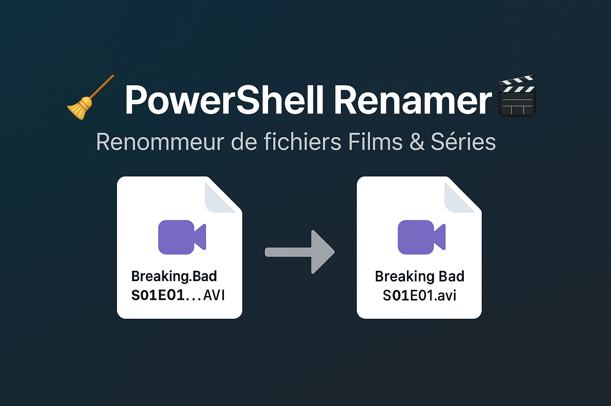

# 🚀 PowerShell Renamer

Bienvenue dans **PowerShell-Renamer**, un script PowerShell intelligent 🧠 conçu pour nettoyer et renommer vos fichiers vidéo téléchargés via torrent. Organisez vos fichiers comme un chef ! 🍿📁

---

## 🛠️ À quoi ça sert ?

Ce script vous permet de renommer automatiquement les fichiers de séries et de films en supprimant les balises inutiles comme `MULTi`, `1080p`, `x264`, etc. Il vous propose un aperçu des modifications avant de les appliquer, vous laissant le contrôle total sur chaque changement.

---

## 🧾 Configuration initiale

Lors de la première exécution, le script vous demandera les chemins vers vos dossiers de films et de séries.
Les chemins seront sauvegardés pour les prochaines utilisations dans un fichier `config.json` à côté du script.

🚨 **Assurez-vous d'utiliser les bons chemins** vers vos dossiers `FILMS` et `SERIES`. Sinon... ça marche pas 🤷‍♂️.

---

## 🎮 Utilisation pas à pas

1. **Ouvrez PowerShell**, avec les droits administrateurs si nécessaire.
2. **Placez-vous dans le dossier contenant le script** à l’aide de la commande suivante (remplace le chemin par le tien) :
   ```powershell
   cd "C:\chemin\vers\le\script"
   ```
3. **Lancez le script** :
   ```powershell
   .\PowerShell-Renamer.ps1
   ```
4. **Saisissez les chemins** de vos dossiers Films et Séries quand demandé (à faire une seule fois si vous les enregistrez).
5. **Utilisez le menu** pour choisir une option :

   - `1` → Simuler renommage des **Films**
   - `2` → Simuler renommage des **Séries**
   - `3` → Simuler renommage des **Films et Séries**
   - `4` → **Valider** et **renommer** les fichiers
   - `Q` → Quitter

---

## 📦 Fonctionnalités

- Détection et nettoyage automatique des noms de fichiers vidéo (films et séries).
- Simulation sans modification pour tout vérifier avant.
- Confirmation pour chaque fichier ou validation en masse.
- Sauvegarde automatique des chemins configurés.

---

## 🦄🚧 Fonctionnalités à venir (ou pas 😅)

- Interface graphique avec des licornes🦄🦄.
- Fusion comme dans DBZ.
- Distributeur de café.

---

## 🤝 Contribution

Les contributions sont les bienvenues ! Si vous avez des suggestions ou des améliorations, n'hésitez pas.

---

## ⭐ Soutien

Fais-toi plaisir, et si tu kiffes le script, laisse une ⭐ sur le dépôt. Ou pas. Mais c’est cool quand même 😉

---

N'hésitez pas à explorer et à adapter ce script à vos besoins. Bonne organisation de vos fichiers vidéo ! 🎬🌟